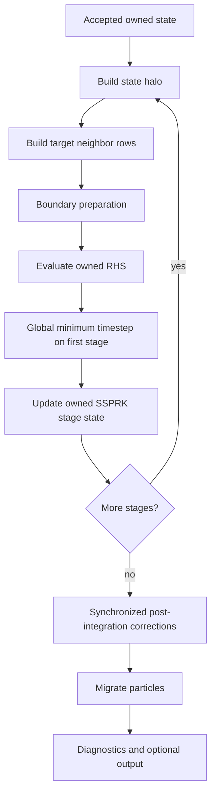

# Distributed Solver Migration

Status: design proposal

Scope: WCSPH solver, particle infrastructure, parallel runtime, result storage,
GUI readers, and tests

## 1. Summary

BlueTit should become a hybrid distributed solver: MPI distributes spatial
subdomains between processes, while TBB continues to parallelize work inside
each process. This is an architectural migration rather than a mechanical
replacement of TBB calls with MPI calls.

The migration is expected to rewrite a substantial part of the current solver.
That is acceptable. The mathematical SPH kernels, field types, geometry
algorithms, and useful TBB primitives should be retained, but particle
ownership, neighbor indexing, equation orchestration, time integration, output,
and testing need distributed-memory semantics designed into them.

The target design has the following properties:

- Every mobile particle has exactly one owning MPI rank and a stable global ID.
- Ranks hold read-only ghost copies of particles needed by local kernel sums.
- SPH equation code performs numerical work but never initiates MPI operations.
- A simulation orchestrator exposes all communication and collective phases.
- TBB operates only on rank-local data; MPI calls are made by the main thread.
- Results and checkpoints are written as typed HDF5 datasets, not database
  blobs.
- Published output frames are immutable and can be read while the simulation
  continues.
- Checkpoints can be restarted with a different number of MPI ranks.
- One-rank execution remains a supported and thoroughly tested configuration.

## 2. Why the Current Design Cannot Just Be Extended

The current `ParticleMesh` builds adjacency over a single complete
`ParticleArray`. It partitions graph edges according to `par::num_threads()` so
that TBB can update both ends of an SPH pair without races. This partitioning is
a shared-memory scheduling mechanism, not distributed spatial ownership.

Several current assumptions conflict with MPI:

- Particle indices are process-local vector offsets, but equations treat them as
  stable for the lifetime of an integration step.
- Fluid and fixed particles are represented by contiguous type ranges. Ghosts
  and migrating particles do not fit that representation cleanly.
- Pair equations update both particles. One endpoint may be owned by another
  MPI rank.
- `SSPRKIntegrator` copies the full particle array and combines stages by local
  index. Migration would invalidate this relationship.
- Free-surface classification relies on shared-memory visibility of neighbor
  fields such as `N` and `phi`.
- The timestep is a local TBB reduction, whereas a distributed explicit solver
  needs the global minimum.
- Every varying particle field is compressed into a SQLite BLOB. SQLite is a
  metadata database, not a scalable parallel array store.
- The GUI directly exposes SQLite series, frame, and array IDs, coupling the
  application to the physical storage backend.

Preserving these interfaces would move distributed complexity into every
caller. The cleaner approach is to replace them with explicit distributed
concepts.

The main current implementation touchpoints are:

- [`source/tit/sph/particle_array.hpp`](source/tit/sph/particle_array.hpp) for
  field storage and type ranges.
- [`source/tit/sph/particle_mesh.hpp`](source/tit/sph/particle_mesh.hpp) for
  adjacency and thread-oriented pair scheduling.
- [`source/tit/sph/fluid_equations.hpp`](source/tit/sph/fluid_equations.hpp) for
  neighbor-dependent equation and correction phases.
- [`source/tit/sph/time_integrator.hpp`](source/tit/sph/time_integrator.hpp) for
  stage ordering and old-state assumptions.
- [`source/tit/data/storage.cpp`](source/tit/data/storage.cpp) and
  [`source/tit/data/hdf5.cpp`](source/tit/data/hdf5.cpp) for SQLite BLOB storage
  and serial HDF5 export.
- [`source/titgui/bindings/storage.cpp`](source/titgui/bindings/storage.cpp) for
  the GUI's physical-storage coupling.
- [`tests/titwcsph/test.cmake`](tests/titwcsph/test.cmake) for the current
  whole-file output checksum.

## 3. Architectural Principles

### 3.1 Separate numerical kernels from orchestration

Equation kernels receive local particle views and neighbor lists. They may use
TBB, but they do not call MPI, migrate particles, rebuild halos, write output,
or perform hidden collectives.

The simulation orchestrator owns the ordered phase graph:

1. Migrate or rebalance at an accepted step boundary.
2. Exchange required halo fields.
3. Rebuild or refresh neighbor data.
4. Evaluate local numerical kernels.
5. Reduce distributed values such as the timestep.
6. Advance owned state.
7. Run explicitly synchronized correction phases.
8. Publish output or a checkpoint when requested.

Keeping collectives visible at this level makes deadlocks, performance, and
field freshness auditable.

### 3.2 Make ownership explicit

An array entry is not implicitly a particle identity. Each mobile particle gets
an opaque `ParticleID`, initially a 64-bit unsigned integer, which remains stable
through local reorderings, migration, output, and restart.

The in-memory model should separate data by lifetime and authority:

```text
ParticleSet
├── owned       mobile particles integrated by this rank
├── ghosts      read-only copies rebuilt by halo exchange
└── boundary    fixed boundary particles or boundary state needed locally
```

Each block remains structure-of-arrays storage. Neighbor references identify a
block and a local offset; they are not serialized and are invalidated whenever
the ghost layer or local ordering changes.

Only owned particles are integrated, migrated, checkpointed as mobile state, or
counted in global diagnostics. Ghost particles are never written by ordinary
equation kernels.

Particle field storage policy must also be independent of equation traits.
Whether a field is uniform, persistent, derived, communicated, or temporary
should be declared explicitly rather than inferred from `required_fields` and
`modified_fields`.

### 3.3 Keep MPI behind a narrow module

Add a `source/tit/dist/` library in namespace `tit::dist`. Its public surface
should cover only the distributed concepts the solver needs:

- RAII MPI environment and non-owning/owning communicators.
- Rank and communicator size.
- Typed collectives and nonblocking point-to-point requests.
- Neighbor topology.
- Halo exchange and reverse accumulation plans.
- Particle migration.
- Distributed partitioning and load metrics.
- Collective error termination and distributed profiling summaries.

MPI-specific datatypes, tags, request lifetime rules, and error codes belong in
this module. The SPH library should depend on distributed abstractions, not raw
`MPI_*` calls.

Initialize MPI with `MPI_THREAD_FUNNELED`: the main thread performs MPI calls and
TBB workers execute local kernels. Requiring `MPI_THREAD_MULTIPLE` initially
would add overhead and substantially complicate correctness.

### 3.4 Preserve a real single-rank path

One MPI rank must execute the same orchestration and ownership model as many
ranks. Avoid maintaining a separate serial solver. A lightweight local
communicator implementation may be used in small unit tests, but production
one-rank runs should also be tested through MPI.

## 4. Target Module Structure

The precise filenames may evolve, but dependency direction should resemble:

```text
tit::core
   ↑
tit::par              local TBB algorithms
   ↑
tit::dist             MPI, topology, exchange, migration
   ↑
tit::sph
├── fields            field definitions and storage traits
├── particles         owned/ghost/boundary SoA blocks
├── neighbors         local search and target neighbor rows
├── equations         communication-free numerical kernels
├── integrators       stage coefficients and owned-state updates
└── simulation        distributed phase orchestration
   ↑
tit::io               run format, snapshots, checkpoints, XDMF
   ↑
titwcsph              configuration and executable lifecycle
```

`tit::io` should depend on stable field descriptors and particle snapshots, not
on concrete equation or integrator classes. The GUI should use `tit::io` readers
through its native binding rather than know about HDF5 groups or SQLite IDs.

### 4.1 Expected change surface

The likely rewrite is intentionally large but not indiscriminate:

| Area | Direction |
| --- | --- |
| Vector/matrix math, kernels, equations of state | Retain with focused API changes |
| Compile-time field names and value types | Retain and extend with explicit storage/exchange traits |
| Geometry, grid search, spatial keys | Reuse as rank-local building blocks |
| TBB algorithms | Retain for intra-rank execution |
| `ParticleArray` | Replace with owned/ghost/boundary SoA blocks and stable IDs |
| `ParticleMesh` | Replace with target-row adjacency over local and ghost data |
| Pair scheduling | Replace thread edge coloring in equation code; add gather and reusable reverse-reduction modes |
| Integrators and `FluidEquations` control flow | Split numerical kernels from distributed orchestration |
| SQLite `Storage` and HDF5 export | Replace with direct run readers/writers and parallel HDF5 |
| GUI native storage bindings | Rewrite against the logical run-reader API |
| WCSPH executable | Reduce to configuration, construction, and simulation lifecycle |
| End-to-end tests | Replace file checksums with semantic, rank-aware validation |

This boundary protects the validated numerical formulas while removing data and
control structures whose assumptions are inherently single-process.

## 5. Spatial Decomposition

### 5.1 Initial implementation

Start with a static Cartesian decomposition of the simulation bounding box.
Rectangular subdomains make ownership, neighbor discovery, and halo intersection
easy to validate:

- A 2D rank communicates with at most eight adjacent ranks.
- A 3D rank communicates with at most 26 adjacent ranks.
- The ghost thickness is at least the maximum kernel support radius that can
  affect an owned target.
- Domain geometry is replicated initially because it is small and immutable.
- Fixed boundary state may also be replicated initially, then restricted to
  enlarged local subdomains if its memory or computation becomes material.

Production initialization should generate or read only the particles belonging
to each rank's spatial region. Generating the complete problem on rank zero and
scattering it is acceptable only as a temporary small-test implementation; it
must not become the input architecture for large runs. All ranks should verify
that they received the same immutable configuration, for example by broadcasting
the canonical configuration and checking its schema/version once.

The ownership convention on shared subdomain faces must be unambiguous, for
example half-open bounds with the global maximum face closed.

### 5.2 Halo construction

A halo plan records which owned particles are sent to which neighboring ranks
and where received ghosts are stored. It should support compile-time field
bundles so phases exchange only the data they require.

A normal state halo initially contains:

```text
ParticleID, particle kind, position, velocity, density, mass
```

Uniform constants are communicator-wide configuration and should not be sent
per particle. Pressure and sound speed can normally be recomputed from density.
Scratch derivatives should not be included in a normal halo.

Packing should be explicit and type-safe. Do not transmit arbitrary C++ object
representations. The existing compile-time field system can be reused to build
contiguous field buffers and HDF5 descriptors.

If smoothing length or another support-controlling value becomes particle-local,
it becomes part of both migration and the relevant halo bundle. Halo width must
then be derived collectively from actual support bounds rather than a uniform
constant.

### 5.3 Migration

Ownership changes only at accepted timestep boundaries in the first
implementation. SSPRK stage state therefore remains on one rank for the entire
step. A particle may move slightly outside its owner's geometric subdomain
during a stage, but halo routing must use its current position.

The timestep and halo guard must ensure a particle cannot cross an unsupported
communication region during one complete step. Check this invariant in debug
builds instead of assuming it silently.

At the end of a step:

1. Determine the owner of each current position.
2. Pack all persistent fields of particles leaving the rank.
3. Exchange counts and payloads.
4. Remove sent particles and append received particles.
5. Rebuild ID-to-local-index maps and invalidate neighbor/halo plans.

### 5.4 Dynamic load balancing

Do not make distributed RIB or K-means a prerequisite for the first correct
solver. Once static decomposition is stable, add a `Partitioner` interface and
a distributed space-filling-curve implementation using Morton or Hilbert keys.
The repository already contains relevant spatial sorting code.

Rebalance only when a measured work imbalance exceeds a threshold, and no more
frequently than a configured interval. Particle count alone is an incomplete
load metric; boundary work, neighbor count, and measured kernel time should be
available as weights.

Repartitioning must be restart- and rank-count-independent. Stored results do
not encode the runtime decomposition as part of physical state.

## 6. Neighbor Graph and Pair Evaluation

The distributed neighbor graph stores rows only for targets evaluated locally:
owned fluid particles and any locally evaluated boundary targets. A row may
refer to owned, ghost, or boundary neighbors. Building adjacency rows for ghosts
that are never targets wastes memory.

The current symmetric pair traversal writes both pair endpoints and therefore
cannot operate on read-only ghosts. Implement two explicit interaction modes:

### 6.1 Target-centric gather

Each owned target loops over all neighbors and accumulates only its own result.
Cross-rank pairs are evaluated independently by the two owning ranks.

This should be the first correctness implementation because it requires no
reverse force exchange, maps naturally to TBB, and removes the current
thread-oriented edge partitioning from equation code.

### 6.2 Unique-pair accumulation

For equations where computing each pair once is important, assign every pair a
unique evaluator using stable IDs. Accumulate the remote endpoint's increment
into a ghost-side buffer, then perform a reverse halo `reduce_add` to its owner.

This mode can reduce arithmetic and better preserve the existing explicitly
antisymmetric pair formulation, but it introduces another communication phase.
It should be implemented behind a reusable pair-accumulation abstraction and
selected only after performance and conservation comparisons. It must not be
open-coded separately in continuity, momentum, and shifting.

## 7. Distributed Integration Pipeline

The integrator should describe stage coefficients and owned-state combinations;
it should not hide mesh refreshes or equation-specific communication. A
distributed SSPRK3 step should be orchestrated approximately as follows:



The old SSPRK state contains owned persistent fields keyed by the stable local
owned ordering. Because migration is deferred until the accepted step, this
ordering remains valid across its stages. If later algorithms require mid-step
migration, stage state must instead be joined by `ParticleID`.

### 7.1 Global timestep

Each rank computes a minimum over its owned fluid particles. The simulation then
uses `MPI_Allreduce` with `MIN`. Empty ranks contribute positive infinity. The
same global value is reused by all stages of the accepted explicit step.

### 7.2 Interior/halo overlap

Correctness should come before overlap. Initially, complete halo exchange before
neighbor evaluation. Once profiling shows communication is significant, split
targets into interior and interface sets:

1. Start nonblocking halo exchange.
2. Evaluate targets whose support lies entirely inside the local subdomain.
3. Complete the exchange.
4. Evaluate interface targets.

This optimization belongs in orchestration and neighbor planning, not in the
equation formulas.

### 7.3 Free-surface and shifting phases

The current free-surface algorithm contains dependencies that are satisfied by
shared memory. They must become explicit phases:

1. Compute owned `N`, `L`, velocity gradient, and density gradient.
2. Exchange `N` or reverse-reduce pair increments, depending on interaction
   mode.
3. Classify owned free-surface particles without writing neighbors.
4. Exchange `phi`.
5. Classify near-surface owned particles using local and ghost `phi`/`N`.
6. Apply shifts to owned particles.
7. Exchange shifted position, velocity, and density.
8. Compute `rho_raw` and apply the density correction to owned particles.

Every phase should document which fields it reads, writes, and requires fresh in
the halo. Debug builds should track field epochs so stale ghost reads fail close
to their source.

## 8. Boundary Representation

The current fixed particles also provide state associated with boundary
vertices. During the first MPI implementation, replicate boundary geometry and
fixed particles on every rank and evaluate only boundary targets whose support
intersects the enlarged local subdomain.

This avoids distributing topology before particle communication is proven. The
boundary API should nevertheless be separated from mobile ownership so a later
implementation can partition a large surface without changing fluid kernels.

Boundary extrapolation reads fresh local and ghost fluid state. A replicated
boundary particle may have multiple process-local copies, but copies used for
the same physical neighborhood must see a complete support and compute
equivalent state. Boundary values are derived state and are not independently
checkpointed unless a future model makes them persistent.

## 9. Result Storage Redesign

### 9.1 Replace SQLite BLOB storage

The current storage creates one SQLite row per field and stores a Zstd-compressed
array in its `data` BLOB. HDF5 export then reads the entire decompressed array
into an intermediate byte vector before writing it again. This path serializes
all ranks through one database, prevents collective array I/O, duplicates
memory, and couples the GUI to database identities.

SQLite should be removed from the solver output path. It may remain temporarily
as a read-only legacy dependency for a conversion tool, then be deleted if no
other feature uses it.

### 9.2 Logical I/O API

Introduce backend-independent semantic interfaces:

```text
RunWriter / RunReader
FrameWriter / FrameReader
CheckpointWriter / CheckpointReader
FieldDescriptor
```

The API works with typed multidimensional spans and field descriptors. It does
not expose SQL row IDs or HDF5 handles. The solver passes owned SoA spans
directly to the writer. The GUI requests frame metadata and selected field
slices through the reader.

Snapshots and checkpoints are separate concepts:

- A snapshot contains selected analysis/visualization fields. It may omit
  scratch state and may use configurable compression or reduced precision.
- A checkpoint contains all persistent state needed for an exact restart at an
  accepted step boundary. It is lossless and validated before publication.

### 9.3 Primary run format

Use a versioned run directory with one collectively written HDF5 file per
published frame or checkpoint:

```text
dam-break.tit-run/
├── manifest.json
├── index.json
├── geometry.h5
├── frames/
│   ├── frame-00000000.h5
│   ├── frame-00000100.h5
│   └── ...
├── checkpoints/
│   ├── checkpoint-00001000.h5
│   └── ...
└── run.xdmf
```

`manifest.json` is small, versioned metadata: format version, solver/build
information, dimension, field schema, units, configuration, and geometry
references. `index.json` lists only committed frames and checkpoints and is
updated atomically by rank zero.

Each frame file uses ordinary typed datasets:

```text
/particles/id          uint64 [N]
/particles/kind        uint8  [N]
/fields/r              float  [N, dimension]
/fields/v              float  [N, dimension]
/fields/rho            float  [N]
/fields/...            ...
```

Matrices are stored as `[N, dimension, dimension]`; HDF5 supports
multidimensional matrix-valued datasets. Field attributes record semantic name,
scalar kind, components, units if known, and storage precision.

At output time, each rank contributes only owned particles. An exclusive scan
computes its global row offset and a reduction computes `N`. Ranks then write
non-overlapping hyperslabs using parallel HDF5/MPI-IO. Rank-major row order is
acceptable because `ParticleID` provides stable identity; physical results must
never depend on file row order.

Write to a `.partial` filename, collectively close it, synchronize successful
completion, and rename it to the final immutable filename. Only then may rank
zero publish it in `index.json`. Readers ignore partial files. A failed or
incomplete checkpoint must never replace the latest valid checkpoint.

Chunking should target sensible I/O blocks rather than one compressed object;
the initial target is approximately 1--8 MiB chunks, measured on representative
filesystems. Compression is configurable and applied per dataset. Checkpoints
must remain lossless. Avoid mandatory nonstandard HDF5 filters that make files
unreadable without project-specific plugins.

`run.xdmf` is a generated compatibility view for ParaView and similar tools. It
is an index, not the source of truth. Regenerating it from the manifest and frame
metadata must always be possible.

### 9.4 Checkpoint portability

A checkpoint stores owned particles as global datasets, plus:

- Physical time and completed step.
- Persistent particle fields and stable IDs.
- Solver configuration and format/schema versions.
- Domain and boundary references.
- Global next-ID state if particle creation is enabled.
- Validation metadata and optional per-dataset checksums.

It does not require the restart job to use the original rank count. On restart,
ranks collectively read balanced row ranges, reconstruct particles, and
redistribute them through the selected current partitioner.

Derived fields such as pressure, sound speed, adjacency, ghost data, and most
correction scratch fields should be recomputed unless measurements show that
doing so is prohibitively expensive.

### 9.5 GUI and live results

Replace `Storage → Series → Frame → Array` bindings with a run-reader API. The
GUI should enumerate committed frames from `index.json`, inspect field metadata,
and load only fields required for the active view. The native layer can assemble
or stream field chunks without forcing JavaScript to hold every field at once.

Stable 64-bit particle IDs must remain exact in the GUI binding. Expose them as
`BigUint64Array`, strings, or an equivalent lossless representation; do not
convert them to JavaScript `Number`, whose integer precision is insufficient for
the full ID range.

Because a frame becomes visible only after its HDF5 file is closed and
published, the GUI never reads a file that MPI ranks are still modifying. Live
control or high-frequency monitoring should eventually use a bounded streaming
channel, not rely on concurrent reads of the durable checkpoint file.

Provide a one-way `ttdb` conversion utility during the transition. New solver
runs should not write both formats indefinitely.

## 10. Diagnostics, Errors, and Reproducibility

- Normal logging is emitted by rank zero. Rank-local diagnostic logs include
  the rank in their filename or prefix.
- Profiling reports local timings and collective min/mean/max summaries.
- A fatal exception on one rank cannot safely unwind while peers wait in MPI.
  The top-level distributed runtime should report rank/context and terminate the
  communicator consistently.
- Communication buffers remain alive until all nonblocking requests complete;
  request wrappers must enforce this lifetime.
- Global barriers are not general synchronization tools. Use the collective or
  point-to-point operation required by the algorithm.
- Deterministic tests sort particles by `ParticleID`. Bitwise equality across
  rank counts is not a general requirement because reduction and summation order
  change, but physical invariants and configured numerical tolerances are.
- Optional deterministic reduction/pair-order modes may be added for debugging,
  independently of the optimized production path.

## 11. Build and Test Integration

Add an MPI build option and link through CMake's `MPI::MPI_CXX` target. MPI
implementation provisioning belongs to development and CI setup; MPI headers
should not leak into unrelated targets. Parallel HDF5 must be configured against
the same MPI implementation. Keep HDF5/MPI property-list operations behind a
narrow backend wrapper; if HighFive cannot express a required collective I/O
operation reliably, use the HDF5 C API inside that wrapper rather than leaking
backend limitations into solver code.

Extend the existing test registration with an `add_tit_mpi_test` helper that
invokes `${MPIEXEC_EXECUTABLE}` through the normal test driver and records the
requested CTest `PROCESSORS`. All builds and tests continue to run through
`./build/build.sh`.

The distributed test matrix should include:

- One-rank equivalence with the refactored local solver.
- Two- and four-rank results for the same physical case.
- Particles exactly on subdomain faces, edges, and corners.
- Empty ranks and highly imbalanced initial distributions.
- Halo completeness with fixed and variable support radii.
- Particles migrating in both directions repeatedly.
- Restart using the same and a different rank count.
- Free-surface classification across a rank boundary.
- Conservation of mass and bounded momentum/energy drift.
- Snapshot fields equal after sorting by `ParticleID` within documented
  tolerances.
- Interrupted output leaving the previous frame/checkpoint readable.
- GUI reading a run while new committed frames are published.

The current whole-file checksum of `particles.ttdb` should be replaced with a
semantic result checker. HDF5 metadata and rank-major ordering are not stable
byte-for-byte contracts. Tests should hash or compare canonicalized IDs and
selected physical fields, and separately validate the run-format schema.

## 12. Migration Plan and Acceptance Gates

The migration should land in coherent vertical stages. Avoid maintaining two
complete solver implementations for a long period.

### Phase 0: Establish the reference

- Record physical invariants and canonical field snapshots for representative
  small cases.
- Add focused tests around continuity, momentum, shifting, and boundary
  extrapolation rather than relying only on the long dam-break checksum.
- Capture time and memory profiles for neighbor search, equation evaluation,
  correction, and output.

Acceptance: the current algorithm has a numerical baseline detailed enough to
detect regressions after its data structures change.

### Phase 1: Rewrite local particle and neighbor infrastructure

- Introduce stable IDs and explicit owned/ghost/boundary blocks.
- Decouple field storage policy from equation requirement traits.
- Replace full symmetric adjacency with target neighbor rows.
- Convert equations to target-centric accumulation on one rank.
- Make free-surface phases explicit without MPI.

Acceptance: one-rank results match the Phase 0 baseline within agreed tolerances,
with no MPI communication required for the numerical unit tests.

### Phase 2: Replace storage and GUI bindings

- Add the run reader/writer abstractions and serial HDF5 backend using the new
  schema.
- Write snapshots and checkpoints directly from SoA spans.
- Update the GUI to the run-reader API.
- Add XDMF generation and the legacy `ttdb` converter.
- Remove new writes to SQLite.

Acceptance: one-rank runs, restart, GUI visualization, and export work without a
`.ttdb` file; memory use does not require a second full uncompressed frame.

### Phase 3: Add the distributed runtime

- Add `tit::dist`, MPI lifecycle, collectives, Cartesian topology, and MPI test
  support.
- Run the existing local storage/orchestration model under one MPI rank.
- Add the global timestep reduction and rank-aware logging/profiling.

Acceptance: one-rank MPI results remain equivalent and distributed failures
produce useful diagnostics instead of hanging.

### Phase 4: Static multi-rank solver

- Partition initial owned particles.
- Exchange state halos and build local-plus-ghost search indices.
- Evaluate all SSPRK and boundary phases on owned targets.
- Implement explicit free-surface synchronization.
- Add end-of-step migration.
- Write collective HDF5 snapshots and rank-count-independent checkpoints.

Acceptance: two- and four-rank cases pass decomposition, migration,
conservation, restart, and boundary-interface tests.

### Phase 5: Scale and optimize

- Measure target-centric evaluation against unique-pair reverse accumulation.
- Overlap interior computation with halo exchange.
- Reuse halo/search plans while displacement bounds make that safe.
- Add dynamic space-filling-curve load balancing.
- Tune collective HDF5, chunking, field selection, and I/O cadence.
- Add node-scale and multi-node performance regression jobs.

Acceptance: strong- and weak-scaling results identify expected limits, and every
optimization retains the multi-rank correctness suite.

### Phase 6: Remove transitional code

- Remove the legacy SQLite writer and old GUI storage wrappers.
- Remove obsolete edge partitioning if no non-distributed consumer needs it.
- Remove conversion-only dependencies once the supported migration window ends.
- Update the manual and examples to use MPI launch, the run directory, and
  checkpoint/restart workflows.

Acceptance: there is one production solver path and one documented output
format, with no compatibility layer in numerical hot paths.

## 13. Initial Definition of Done

The first useful distributed milestone is a two-rank dam-break simulation with:

- Hybrid MPI plus TBB execution.
- Static Cartesian decomposition.
- Read-only fluid halos and replicated boundary geometry.
- A global timestep.
- Target-centric continuity, momentum, shifting, and free-surface corrections.
- End-of-step particle migration.
- Collective HDF5 snapshots containing stable particle IDs.
- Restart on a different rank count.
- GUI access to committed frames.
- Numerical agreement with the one-rank baseline and no whole-file checksum
  dependency.

This milestone deliberately favors explicit phases and correctness over maximum
communication overlap. It establishes the architecture on which load balancing,
pair reductions, asynchronous visualization, and large-cluster I/O can be added
without rewriting the solver a second time.
